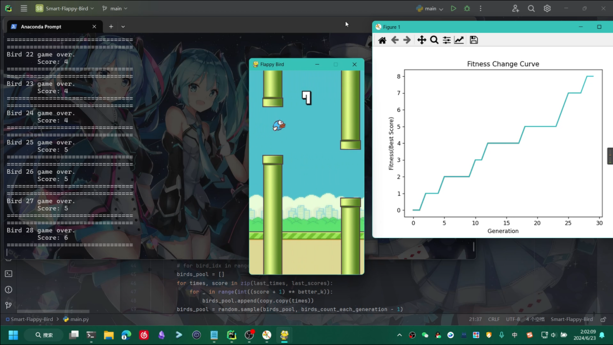
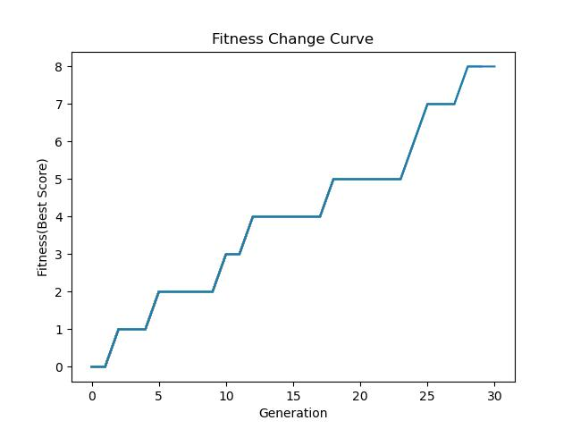

# 遗传算法FlappyBird Genetic-Algorithm-Flappy-Bird

这是重庆邮电大学《智能控制》课程的课程设计，用于实现遗传算法下的自适应FlappyBird游戏。

测试表明使用了遗传算法的控制器可以较好地提高游戏分数。

## 启动方式

运行`main.py`即可。

可以按需修改`config.py`中的配置。

## 原理

程序每次迭代都创建多个小鸟个体，每个小鸟个体对应一个游戏窗口。较优的个体被遗传到下一代的概率更大，较差的个体被遗传到下一代的概率更小。适应度（评价标准）是个体得到的游戏分数。

游戏的玩法即找到合适的时机点击屏幕，让小鸟跳跃通过障碍物。因此个体的基因就是一系列时间序列，每通过一段时间（通常是0-2秒之间）就模拟一次点击，让小鸟跳跃。

遗传算法控制器内保存有所有代的个体分数和时间序列，用于生成新的子代。生成子代的概率是根据适应度函数动态变化的。

游戏每一帧都会调用遗传算法控制器，询问是否让小鸟跳跃。控制器会计算距离上次跳跃的时间，当大于等于时间序列中的指定值时返回跳跃指令。

考虑到遗传算法的特点和简化程序的目的，修改了这个游戏的部分设定：

- 地图不随机生成（使用固定种子固定的障碍物位置）。因为遗传算法的特性，其比较适合环境变化不大的情况，为了简化流程，规定了地图固定。
- 游戏启动时由遗传算法控制器传入时间序列，作为小鸟的初始时间序列。初始序列完成后由个体随机动态生成后续的时间序列。当Game Over后，游戏返回当前个体的分数和完整时间序列给遗传算法控制器。
- 游戏的每一帧不再判断用户的操作，而是调用遗传算法控制器，根据控制器的输出判断小鸟是否要跳跃。

## 说明

由于Flappy Bird游戏的特点，前面的适宜的点击时间一旦变化过大，会直接导致游戏失败。因此已经由遗传算法求得的、之前的点击时间不宜变化，即不进行遗传算法的“交叉”操作。

由于时间紧张，程序实现不够优雅，在多实例模拟过程中直接使用了`subprocess`模块启动多个Python实例来实现并行模拟，并且未关闭GUI界面，因此会导致资源占用较高。

## License

[MIT License](./LICENSE)

项目使用并修改了开源项目[FlapPyBird](https://github.com/sourabhv/FlapPyBird)（[MIT License](./FlapPyBird/LICENSE)），位于`FlapPyBird/`文件夹内。
